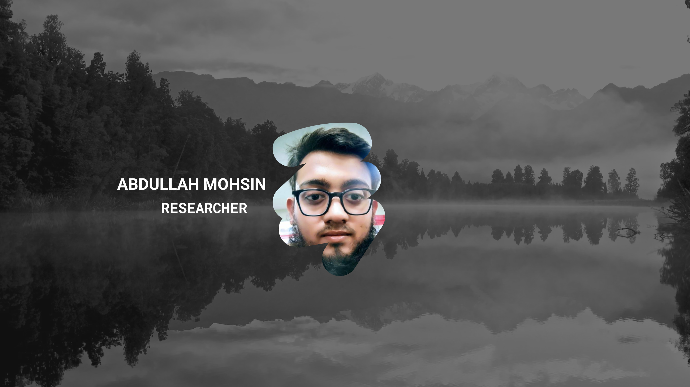

  

---

## About Me
I am a **Software Engineering Technology** student at UIT University.  
Research is a crucial part of academics — exploring gaps helps in developing new ideas or improving existing ones. This is why I enjoy research and innovation.

---

## GitHub Repository
I have completed a number of projects over the past years.  
You can explore all my projects and give feedback here:  
[Abdullah Mohsin GitHub](https://github.com/YourGitHubUsername)

---

## Skills

### Hard Skills
**Programming:**  
- C++  
- Python  
- Java  

**Software Testing:**  
- Google Test  
- Cucumber  
- SonarQube  

**Animation & 3D Modeling:**  
- Blender 3D  

### Soft Skills
- Logical Thinking & Problem Solving  
- Project Management  

---

## Contact

**Phone:** +92 336 3736231  
**LinkedIn:** [Abdullah Mohsin](https://www.linkedin.com/in/mr-abdullah-mohsin-5086a730b/)  

---

## Why Work With Me
I deliver projects on time with **proper explanation and documentation**.  
If anything goes wrong, I will **fix it promptly**. I ensure **quality and professionalism** in all work.

---

### Availability
✅ I am **available now** for projects and collaboration.
