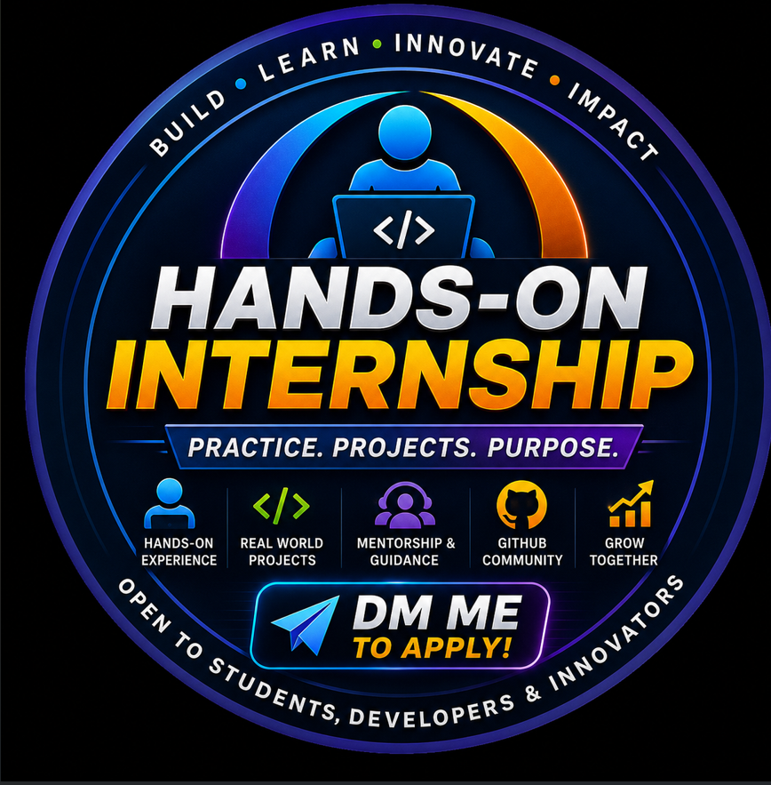
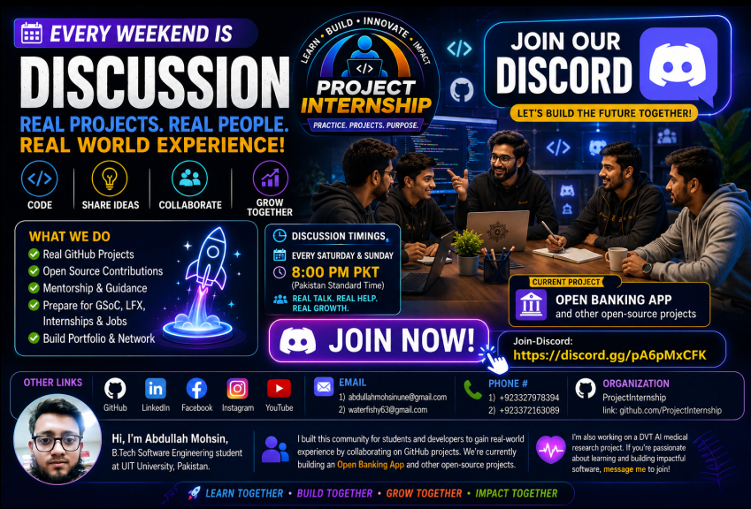
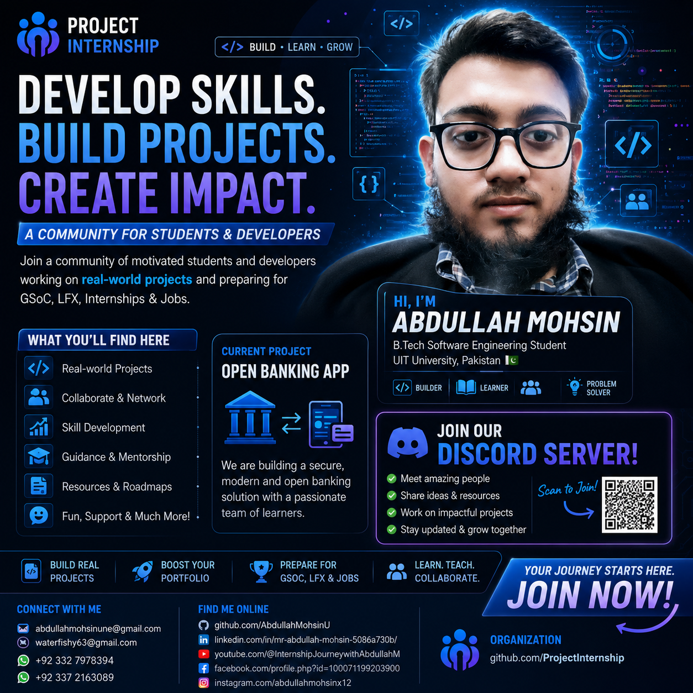

# Abdullah Mohsin(B.Tech-Software)

https://github.com/user-attachments/assets/577ec42f-f42c-4910-968b-997652200c68

  

# Project Hub

### Open-Source GitHub Organization

Building real-world projects, gaining practical experience, and growing together through open-source collaboration.

---

## About Me

Hi, I'm **Abdullah Mohsin**, a **B.Tech Software Engineering student at UIT University, Pakistan**.

I built this community to help students and developers gain **real-world experience** by collaborating on GitHub projects. We are currently building an **Open Banking App** and other open-source projects.

Although the community is currently **unpaid**, contributors can gain:

- Practical software development skills
- Real GitHub projects for their portfolio
- Teamwork and collaboration experience
- Better preparation for **GSoC, LFX, internships, and jobs**
- Experience working on real-world projects

I am also working on a **DVT AI medical research project**. If you are passionate about learning, collaborating, and building impactful software, join our community.

---

## Connect With Me

  

---

## Contact

**Email**

- `abdullahmohsinune@gmail.com`
- `waterfishy63@gmail.com`

**Phone**

- `+92 332 7978394`
- `+92 337 2163089`

---

### Join Project Hub and Build Real-World Projects Together

---

## Sponsorships & Collaborations

